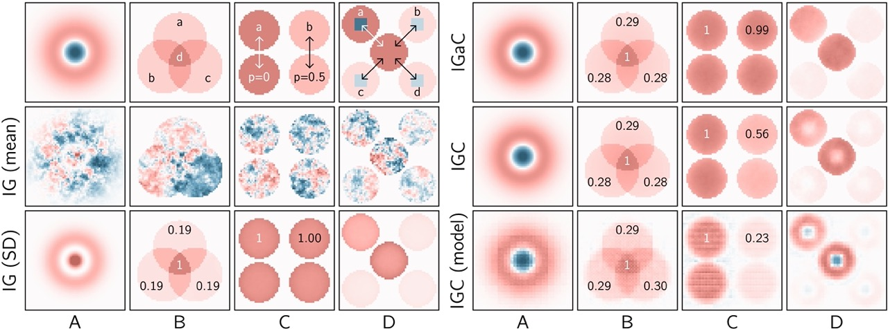
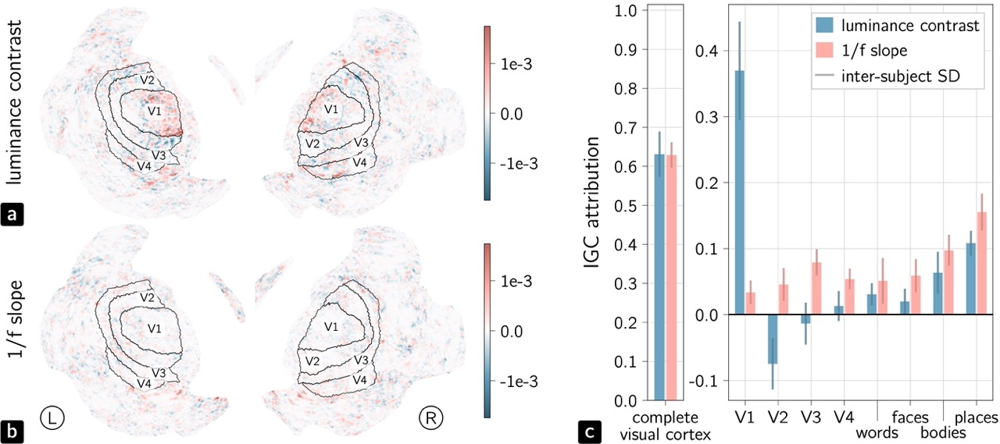
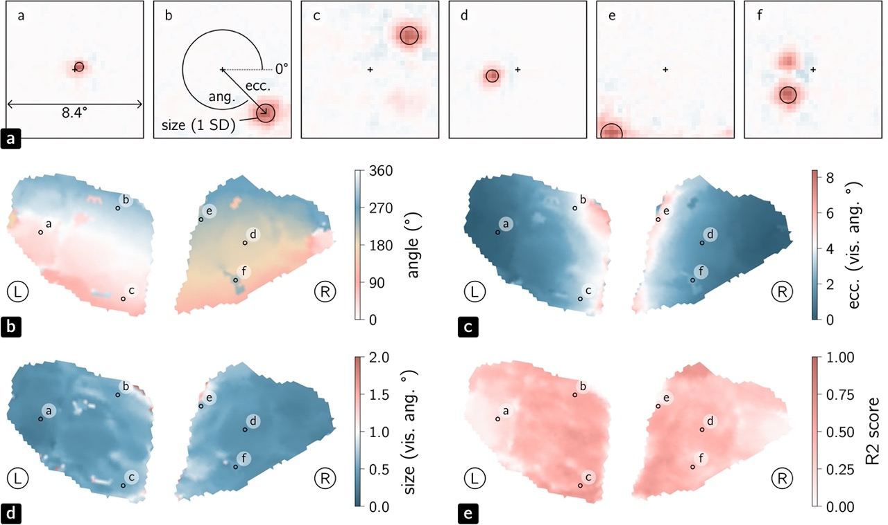

Examples
========

Environment Installation
------------------------

- Create and activate a virtual environment

.. code-block:: console

   python3 -m venv .venv
   source .venv/bin/activate
   pip install -r examples/requirements.txt

- | If you have a GPU supporting `CUDA`_, you can also use the file named
  | `requirements_gpu.txt`.

- Install the IGC package

.. code-block:: console

   pip install .

.. _CUDA: https://developer.nvidia.com/cuda-downloads

IGC Benchmark
-------------

In order to assess the relevancy of IGC attributions compared to other naive
dataset-wise attribution methods, we propose synthetic experiments. We first
define some localized image statistics computed on random images, and then try
to recover the generating masks/rules from the pairs of original images and
computed statistics. To make this procedure feasible, generated random images
are designed to respect the spatial frequency distribution of natural images
(i.e. having some spatial redundancy). For more details, look at the `Benchmark`
section of the original IGC `paper`_.

.. note::

   These example are available as a `notebook`_.

.. _paper: http://arxiv.org/abs/2404.13910
.. _notebook: https://github.com/plelievre/int_grad_corr/blob/main/examples/igc_benchmark.ipynb

Representation of Image Statistics in the Brain
-----------------------------------------------

IGC is employed on a deep decoding model that predicts image statistics from the
neural activity (fMRI) induced by the vision of corresponding image stimuli.
IGC attributions then enable the investigation of the representation of image
statistics in the brain.

.. note::

   Not released yet. See more information in the original IGC `paper`_.

Visual Receptive Field of Neural Populations
--------------------------------------------

IGC is employed on a deep encoding model that predicts the neural activity
(fMRI) from original image stimuli. IGC attributions then reflect the localized
image area for which each group of neurons is responsive, i.e. their population
receptive field (pRF).

.. note::

   Not released yet. See more information in the original IGC `paper`_.

